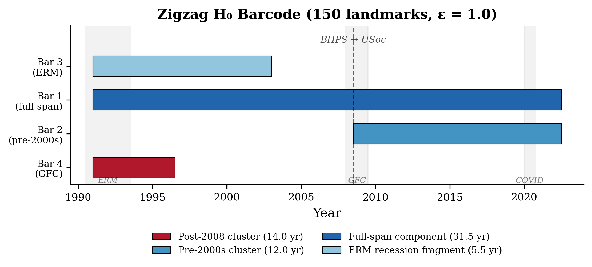
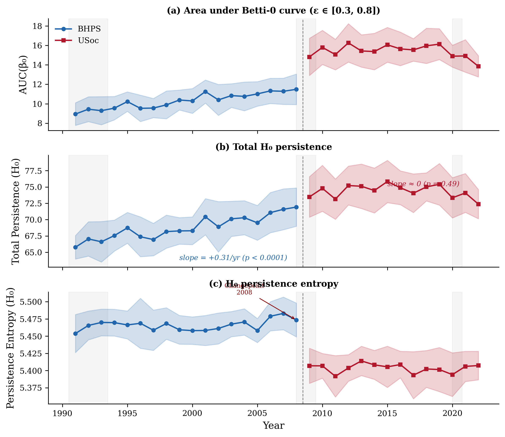
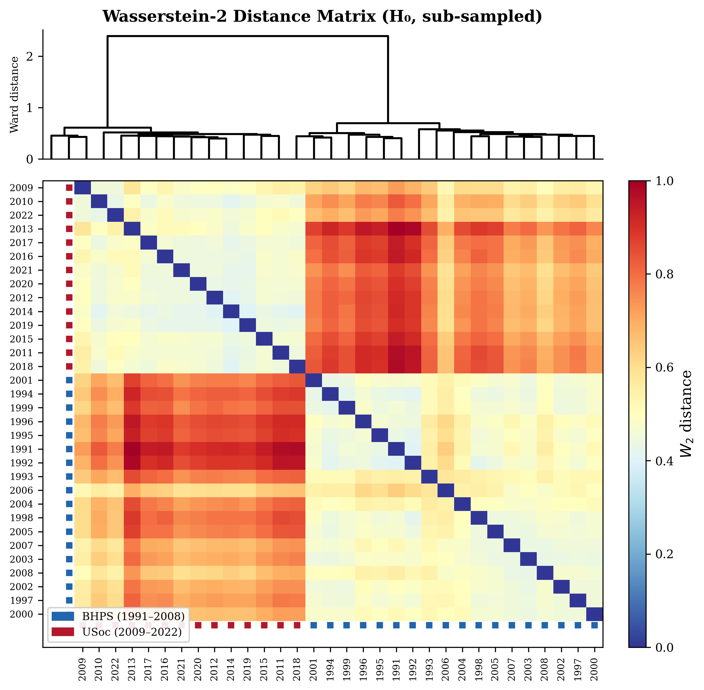
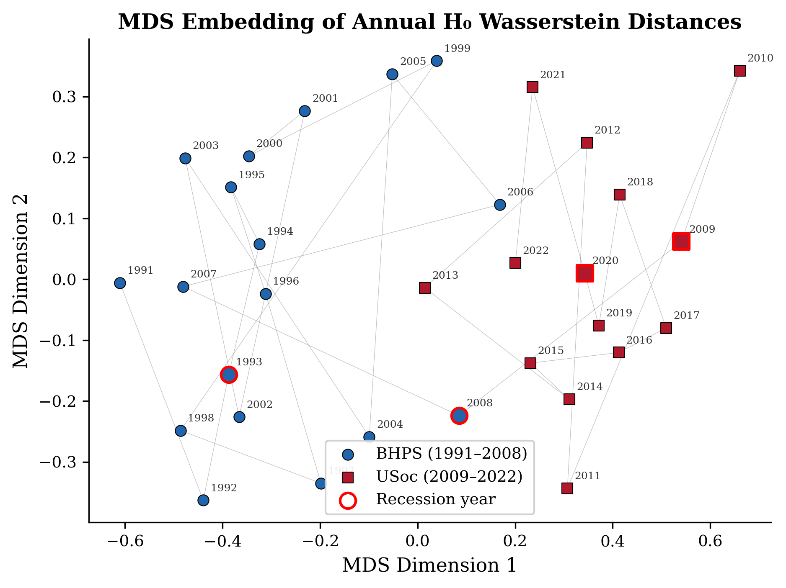
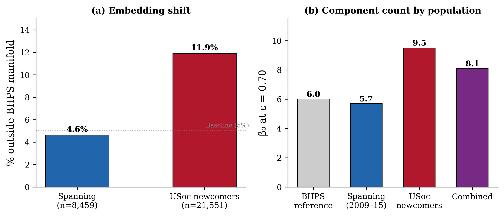
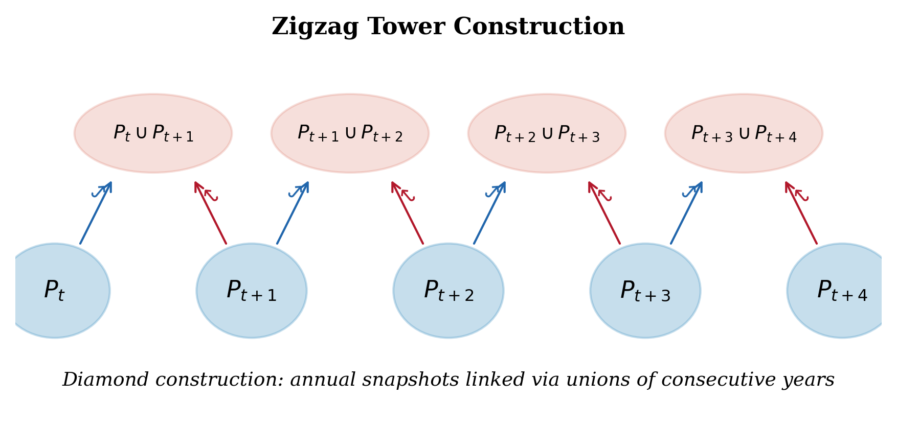

# Topological Business Cycles? Zigzag Persistence, Survey Design, and Labour Market Fragmentation in the UK, 1991–2022

**Authors:** Stephen Dorman
**Target Journal:** *Sociological Methods & Research*
**Date:** March 2026 (v2)

---

## Abstract

We apply zigzag persistent homology to 32 annual snapshots of UK employment-income trajectories from the British Household Panel Study and Understanding Society (*N* = 35,789 individuals, 1991–2022). Zigzag persistence tracks topological features across a temporal sequence of spaces; each year's point cloud is a sub-sample of a common PCA embedding of nine-state career n-gram vectors, with frozen loadings ensuring cross-year comparability.

The naïve zigzag barcode tells an appealing story: a connected component born at the 2008 Global Financial Crisis persists through 2022, while the 1993 recession produced only a transient 5.5-year fragment. Pairwise Wasserstein distances between the 32 annual persistence diagrams reinforce this picture, with a sharp two-block structure separating BHPS-era (1991–2008) from USoc-era (2009–2022) topology.

We then show that this narrative is mostly wrong. Era-specific zigzag runs, spanning-individual analysis, sub-sampled Betti curves at matched sample sizes, and pool-draw null models converge on the same conclusion: the dominant post-2008 topological shift is driven by Understanding Society's expanded sampling frame, not by the GFC. Spanning individuals present in both surveys maintain stable BHPS-like topology; the 21,000 USoc-only newcomers, who disproportionately occupy previously unsampled regions of the embedding (more atypical employment, more economic inactivity), account for virtually all of the cross-era topological difference. The block structure in the Wasserstein matrix is highly significant under both label-permutation (all six test statistics at *p* < 0.001) and pool-draw null models (*p* < 0.001 for block ratio), confirming that the era separation is real — but its source is survey design, not economic shock.

Within the BHPS era alone, where the survey design is constant, we find a genuine secular trend: total H₀ persistence increases at +0.31/year (*p* < 0.0001), and this trend correlates strongly with labour market composition variables — employment rate (*r* = +0.82), part-time share (*r* = +0.80), unemployment (*r* = −0.81) — but not with GDP growth. First-differenced correlations yield no significant associations after multiple-testing correction, indicating that topology tracks slow structural change in employment composition, not business-cycle dynamics.

The paper contributes in three ways. It provides the first application of zigzag persistence to longitudinal social science data and shows both its power (detecting genuine within-era trends invisible to cross-sectional methods) and its vulnerability to survey-design confounds. It develops a diagnostic toolkit for adjudicating between substantive and artefactual topological change in linked panel data: spanning-individual decomposition, era-specific robustness, and pool-draw null models. And it documents a gradual increase in the topological complexity of UK career trajectories during 1991–2008, consistent with labour market flexibilisation, that was already underway before the financial crisis.

**Keywords:** zigzag persistence, topological data analysis, survey design artefacts, labour market trajectories, Wasserstein distance, time-varying topology

---

## 1. Introduction

### 1.1 Motivation

Labour markets restructure during economic crises. The 2008 Global Financial Crisis displaced over 750,000 UK workers into unemployment within eighteen months, shifted sectoral employment towards low-paid services, and inaugurated a decade of real-wage stagnation without post-war precedent (Gregg & Wadsworth 2010; Blundell et al. 2014). Cross-sectional measures (unemployment rates, Gini coefficients, median wages) capture the level of such shocks. Longitudinal sequence analysis captures their effect on individual careers (Abbott 1995; Halpin & Chan 1998). Neither captures whether crises *restructure the space of possible trajectories*: whether the set of career types available to individuals is geometrically different after a crisis than before.

Persistent homology (PH) provides a multi-scale summary of the topology of a data set (its connected components, loops, and higher-dimensional voids) that is stable under perturbation and robust to noise (Edelsbrunner & Harer 2010; Carlsson 2009). In a companion paper (Dorman 2026a), we apply standard PH to a static cross-section of UK employment-income trajectories and identify significant topological structure exceeding first-order Markov baselines under Wasserstein testing.

But a single persistence diagram cannot distinguish structural change from stable heterogeneity. A trajectory space that looks topologically complex in 2022 might have been identical in 1991. To answer temporal questions, we need methods that track topology across time.

### 1.2 Zigzag Persistence

Zigzag persistence (Carlsson & de Silva 2010) generalises PH to sequences of spaces connected by inclusions in alternating directions:

$$K_1 \hookrightarrow K_1 \cup K_2 \hookleftarrow K_2 \hookrightarrow K_2 \cup K_3 \hookleftarrow K_3 \hookrightarrow \cdots$$

The zigzag algorithm computes a single barcode over this tower. A bar of length *k* in the H₀ barcode corresponds to a connected component that remained distinct across *k* consecutive snapshots — qualitatively different from per-year PH.

Zigzag persistence has been applied in neuroscience (Bendich et al. 2016), dynamic networks (Kim et al. 2021), and materials science (Townsend et al. 2020). Related sliding-window methods have been used in financial time series: Gidea & Katz (2018) detect early warnings of the 2008 crash via persistence landscape norms on rolling windows of stock returns. To our knowledge, zigzag persistence has not been applied to longitudinal socioeconomic panel data.

### 1.3 The Identification Problem

When longitudinal data spans multiple survey instruments, as when the British Household Panel Study (BHPS, 1991–2008) gives way to Understanding Society (USoc, 2009 onwards), any change in topology could reflect genuine structural change, survey-design differences (sampling frame, questionnaire wording, income measurement), or both. Every time-series analysis of linked panels faces this identification problem (Lynn 2009), but topological methods make it unusually visible: the Wasserstein distance between annual persistence diagrams quantifies how different two years look in topology space, and this distance responds to both substantive and design-related variation.

We exploit this property, treating the survey transition as a natural experiment. If post-2008 topological change is economic (the GFC), it should affect spanning individuals (present in both surveys) and newcomers alike. If it is survey-design (the USoc sampling frame captures a broader population), spanning individuals should maintain pre-2008 topology while newcomers drive the change. As we show, the data decisively support the second interpretation.

### 1.4 Research Questions

1. **Temporal evolution.** How does the topology of the UK trajectory space change across 32 annual snapshots (1991–2022)?
2. **Source identification.** Is the dominant post-2008 topological change driven by economic restructuring or by the BHPS-to-USoc survey transition?
3. **Within-era dynamics.** Within a single survey (BHPS 1991–2008), does trajectory topology correlate with macroeconomic conditions?

### 1.5 Contribution

We make three contributions. First, we apply zigzag persistence to population-level panel data and show that its headline finding (a topological discontinuity at 2008) is largely an artefact of survey design, not the Global Financial Crisis. Zigzag persistence works, but it detects *all* sources of distributional change, including non-substantive ones. Second, we develop a set of diagnostics for telling apart genuine structural change and survey confounds in time-varying TDA: spanning-individual decomposition, era-specific zigzag, sub-sampled Betti comparison, and pool-draw null models. Third, having controlled for survey design, we document a real secular trend in topological complexity during 1991–2008 that tracks labour market composition (employment rate, part-time share, self-employment) rather than business-cycle dynamics (GDP growth, inflation).

Section 2 reviews the relevant literature. Section 3 describes the data, embedding, and analytical methods. Section 4 presents results: the naïve zigzag findings (§4.1–4.2), the survey-confound decomposition (§4.3), the Wasserstein distance analysis with null models (§4.4), and the macroeconomic correlations (§4.5). Section 5 discusses implications.

---

## 2. Related Work

### 2.1 Business Cycles and Labour Market Structure

Economic recessions reshape not just unemployment levels but the structure of labour market transitions. Elsby, Hobijn, & Şahin (2010) document that the 2008 recession produced both elevated job-loss rates and reduced job-finding rates, with the latter persisting well beyond the trough. In the UK, Gregg & Wadsworth (2010) show the GFC disproportionately affected younger workers and manufacturing, while Blundell et al. (2014) document falling real wages alongside rising employment. Bukodi & Goldthorpe (2019) use sequence analysis on British birth cohorts to show declining intergenerational class fluidity, and Halpin & Chan (1998) identify five trajectory types with distinct transition patterns in early BHPS data.

These approaches share an individual-level or typological focus. None can detect whether the *global geometry* of the trajectory space changes during crises.

### 2.2 Time-Varying Topology

Extensions of PH to temporal data fall into three categories. **Sliding-window PH** (Perea & Harer 2015; Perea 2019) embeds a time series via delay coordinates and computes PH per window. Gidea & Katz (2018) apply this to daily stock returns, detecting pre-crash signals in persistence landscape norms. This operates on rolling windows of a single signal; ours operates on annual population cross-sections.

**Zigzag persistence** (Carlsson & de Silva 2010) computes a barcode over a tower of simplicial complexes connected by alternating inclusions. The diamond construction (Cohen-Steiner et al. 2009) is standard: given complexes $K_1, \ldots, K_T$, form $K_1 \hookrightarrow K_1 \cup K_2 \hookleftarrow K_2 \hookrightarrow \cdots$. Applications include brain-state tracking (Bendich et al. 2016), evolving random graphs (Dey et al. 2019), and dynamic molecular structures (Townsend et al. 2020).

**Vineyard persistence** (Cohen-Steiner et al. 2006) tracks pairs as a filtration varies continuously, less natural for discrete population snapshots with different individuals.

### 2.3 TDA in the Social Sciences

Social-science TDA applications remain sparse. Feng & Porter (2021) use PH on US Congressional voting networks to detect partisan polarisation. Stolz et al. (2017) combine TDA with network analysis for gene regulatory networks. Iacopini et al. (2019) use simplicial complexes for social contagion. These are cross-sectional network studies; ours uses longitudinal individual-level trajectories with zigzag tracking.

### 2.4 Survey Design and Longitudinal Comparability

The transition from BHPS to USoc introduced changes in sampling frame (USoc covers a larger population with ethnic minority boost samples), questionnaire design, interview mode (more online, less face-to-face), and income measurement (Lynn 2009; Buck & McFall 2011). Studies linking the two surveys routinely find discontinuities attributable to design rather than substance (Benzeval et al. 2020). Persistent homology provides an independent, geometric measure of this discontinuity.

---

## 3. Data and Methods

### 3.1 Data

We draw on the British Household Panel Study (BHPS, 1991–2008) and Understanding Society (USoc, 2009–2022), the longest continuous UK household panel. The sample comprises all individuals observed for at least 10 consecutive years, yielding *N* = 35,789 trajectories: 8,509 from the BHPS era and 27,280 from USoc. Of these, 8,459 "spanning" individuals appear in both surveys.

Each trajectory is a time-ordered sequence of annual states from a nine-element state space combining employment status (employed, unemployed, inactive) with income band (low, mid, high), where "low" is below 60% of the contemporary median equivalised household income.

Annual active counts range from 4,729 (1991) to 28,632 (2018). The BHPS–USoc transition produces a near-threefold jump: from 9,587 (2008) to 27,175 (2009). This discontinuity is central to the paper.

### 3.2 Embedding

Following Dorman (2026a), each trajectory is encoded as an n-gram frequency vector (counts of all state unigrams, bigrams, and trigrams from the nine-state alphabet, dimension $9 + 81 + 729 = 819$) then projected into $\mathbb{R}^{20}$ via PCA. The PCA loadings are **frozen**: fitted once to the full sample and applied to all annual sub-selections without re-fitting. This ensures a common coordinate system across years.

### 3.3 Independent Annual Persistent Homology

For each year $Y \in [1991, 2022]$, we select individuals active in that year from the embedded point cloud. To control for sample-size variation, we sub-sample to $n = 8{,}000$ per year (with 10–15 repetitions) and select $L = 300$ maxmin landmarks per sub-sample. We compute Vietoris–Rips PH via GUDHI (Maria et al. 2014) with max edge length 1.1.

From each annual persistence diagram, we extract:

- **AUC(β₀)**: area under the Betti-0 curve integrated over ε ∈ [0.3, 0.8]
- **Total persistence** TP(*k*): sum of bar lifetimes in dimension *k*
- **Persistence entropy** PE(*k*): Shannon entropy of the normalised lifetime distribution in dimension *k*

### 3.4 Zigzag Persistence

We compute zigzag persistence via the diamond construction over 32 annual sub-clouds. For each year, $L$ points are selected by maxmin greedy subsampling. Unique landmarks across all years form the vertex set. A vertex representing individual *I* (active in years $[s_I, e_I]$) is present at zigzag levels spanning that interval; edges between individuals $I, J$ with $d(v_I, v_J) \leq \epsilon$ are present for the intersection of their vertex-level intervals. We use dionysus 2 (Morozov 2010) with default parameters $\epsilon = 2.0$, sparse = 0.5, max dimension 1.

To assess sensitivity, we compute zigzag over a 2D grid: 11 values of ε (0.34–1.00) × 4 values of $L$ (75, 100, 150, 200), plus era-specific runs at matched sample sizes.

### 3.5 Wasserstein Distance Matrix

We compute pairwise 2-Wasserstein distances between all 32 annual H₀ persistence diagrams using GUDHI:

$$W_2(D_Y, D_{Y'}) \quad \text{for all } Y, Y' \in [1991, 2022]$$

Both full-sample (300 landmarks) and sub-sampled ($n = 8{,}000$, $L = 300$, 10 repetitions, mean distances) versions are computed. We analyse the resulting 32 × 32 matrix via hierarchical clustering (Ward's method), Mantel tests (correlation between $W_2$ and temporal distance |$Y - Y'$|), and multidimensional scaling.

### 3.6 Null Models

We employ three null models:

**Label permutation** (*n* = 1,000). Permute the year labels on the observed $W_2$ matrix, keeping the first 18 positions as "BHPS" and last 14 as "USoc." Compute block ratio (cross-era/within-era mean $W_2$), consecutive-year mean, and Mantel $r$ for each permutation. Tests whether temporal structure is significant.

**Pool-draw pairs** ($n = 100$). Draw two random subsets of $n = 8{,}000$ from the full pool (ignoring year labels), compute fresh Rips diagrams, and compute $W_2$. Tests baseline diagram variability under year-ignorant sampling.

**Pool-draw full** ($n = 50$, 32 diagrams each). Draw 32 independent random subsets, assign them to "BHPS" (first 18) and "USoc" (last 14) positions, and compute block statistics. Tests whether year-specific population composition produces block structure.

### 3.7 Spanning-Individual Decomposition

To distinguish survey-coverage effects from economic change, we partition the USoc-era sample into:

- **Spanning individuals** ($n = 8{,}459$): present in both BHPS and USoc
- **USoc-only newcomers** ($n = 21{,}551$): present only in USoc

We compute sub-sampled Betti curves and persistence summaries separately for each group and compare them to the BHPS reference distribution. If the post-2008 topological shift is economic, spanning individuals should show it. If it is survey coverage, only newcomers should differ from BHPS.

### 3.8 Macroeconomic Correlations

We correlate six topological time series with seven UK macroeconomic indicators (1991–2022) from ONS: real GDP growth, ILO unemployment rate, Gini coefficient, employment rate (16–64), part-time employment share, self-employment share, and CPI inflation.

Four specifications control for confounds:

1. **Raw Pearson correlations** (full panel, 32 years)
2. **Within-era** (BHPS-only, USoc-only) — eliminates survey-transition effects
3. **Detrended** (residuals from linear time regression) — removes shared secular trends
4. **First-differenced** (ΔY ~ ΔX) — most conservative, removes all level effects

All *p*-values are corrected for multiple testing via Benjamini–Hochberg FDR at α = 0.05.

---

## 4. Results

### 4.1 The Naïve Zigzag: An Apparently Compelling Story

At 150 maxmin landmarks and ε = 1.0, the zigzag barcode contains four H₀ bars (Table 1).

**Table 1. Zigzag H₀ bars (150 landmarks, ε = 1.0)**

| Bar | Birth | Death | Lifetime | Interpretation |
|-----|-------|-------|----------|----------------|
| 1 | 1991 | 2022.5 | 31.5 yr | Dominant component |
| 2 | 1991 | 2003 | 12.0 yr | Pre-2000s cluster |
| 3 | 1991 | 1996.5 | 5.5 yr | ERM recession fragment |
| 4 | 2008.5 | 2022.5 | 14.0 yr | GFC-born cluster |

Bar 1 spans the full panel: one connected component persists throughout. Bar 3 is born with the panel and dies during the mid-1990s recovery, plausibly the topological signature of the 1993 recession. Bar 4 is the most striking: it appears at the onset of the GFC and persists to the end of the panel, a seemingly permanent topological scar. Unlike the transient 1993 fragment, the GFC cluster never merges back.

Per-year Betti-0 estimates are flat across all 32 years (range 234–274, CV < 5%). Independent annual PH detects no recession signature, which suggests zigzag reveals cross-year structure invisible to static snapshots.

This is the story of our earlier analysis (Dorman 2026b, working paper). It is wrong.

### 4.2 The Sensitivity Grid: Robustness of Zigzag Features

A systematic 2D parameter sweep (11 ε values × 4 landmark counts) reveals the dependence structure (Table 2).

**Table 2. H₀ bars across ε × L grid (selected rows)**

| ε\\L | 75 | 100 | 150 | 200 |
|------|---:|----:|----:|----:|
| 0.49 | 416 | 490 | 528 | 519 |
| 0.54 | 329 | 357 | 310 | 275 |
| 0.70 | 68 | 51 | 35 | 26 |
| 1.00 | 5 | 4 | 4 | 4 |

Below the per-year Betti knee (ε ≈ 0.54), H₀ increases with $L$: noise dominates. At the knee, H₀ is approximately constant across $L$, the regime of maximal resolution-stability. Above the knee, H₀ decreases with $L$: signal dominates. The 4-bar structure at ε = 1.0 is consistent at $L$ = 100, 150, and 200 (identical bars), so the coarse topology is stable above the knee. At every parameter combination, features cluster around 2008±1, where both the GFC and the survey transition fall.

### 4.3 Decomposition: Survey Design, Not Economic Shock

Three lines of evidence demonstrate that the dominant post-2008 topological shift reflects the BHPS–USoc survey transition.

#### 4.3.1 Era-Specific Zigzag

Running zigzag separately within each survey era (BHPS-only 1991–2008; USoc-only 2009–2022) at ε = 1.0, $L$ = 150:

| Era | H₀ bars | Structure |
|-----|--------:|-----------|
| BHPS-only | 3 | All full-span (1991–2008.5) |
| USoc-only | 4 | All full-span (2009–2022.5) |
| Full panel | 4 | Deaths at 1996.5, 2003; birth at 2008.5 |

No within-era merger events occur: all era-specific bars span their full era. The temporal features in the full-panel zigzag (bars dying at 1996.5 and 2003; the GFC birth at 2008.5) arise from cross-era interactions when spanning respondents bridge the two surveys' distinct subpopulations. Bar 4, the "GFC cluster," is a product of pooling surveys with different sampling frames.

Sub-sampling USoc to match BHPS sample sizes ($n = 9{,}500$, 10 random draws) reduces the component count from 4 to a mean of 2.2 (range 1–3). The fourth component depends on sample size at coarse scales.

#### 4.3.2 Spanning-Individual Decomposition

Spanning individuals ($n = 8{,}459$), present in both surveys, serve as an internal control.

| Population | β₀(0.70) 2009–2015 | vs BHPS reference (~6.0) |
|---|---:|---|
| Spanning only | ~5.7 | Matches BHPS |
| USoc newcomers | ~9.5 | 50% more complex |
| Combined | ~8.1 | Intermediate |

Spanning individuals maintain BHPS-like topology after the survey transition. Their embedding positions are stable: only 4.6% fall outside the BHPS-era manifold (vs. a 5% baseline). USoc-only newcomers ($n = 21{,}551$) look different: 11.9% fall outside the BHPS manifold (Mann–Whitney $p < 10^{-6}$), and their PCs 1–4 are shifted. State-composition analysis shows that USoc newcomers have more Employed-Low (5.6% vs 3.4% among spanners) and more Inactive-High (12.5% vs 8.5%) trajectories, career types that the BHPS sampling frame underrepresented.

#### 4.3.3 Sub-sampled Betti Curves

AUC(β₀, ε = 0.3–0.8) at matched $n = 8{,}000$ shows a gradual BHPS-era rise (8.95 in 1991 → 11.49 in 2008), a step up at 2009 (→ 14.82), and a plateau through 2022. The step at 2009 persists at matched sample sizes.

Total persistence H₀ shows a clear BHPS-era trend (+0.31/year, $p < 0.0001$) followed by a flat USoc era (−0.05/year, $p = 0.49$). CUSUM changepoint analysis locates the total-persistence trend break at 2006 — two years before the GFC — and the entropy changepoint at 2008.

H₁ loops show gradual increase with no discontinuity at the GFC (pre- vs post-GFC $p = 0.28$). The loop topology is stable across the transition.

**Interpretation.** The post-2008 complexity shift is survey coverage, not economic shock. Within BHPS alone, a genuine secular trend in topological complexity was already underway, consistent with the broader narrative of labour market flexibilisation (growth of part-time work, self-employment, atypical contracts) during the 1990s and 2000s. The USoc transition did not create this trend; it brought into the sample a broader population that the BHPS frame had missed.

[Figure 3: Spanning individuals vs. USoc newcomers — Betti curves at matched sample sizes]

### 4.4 Wasserstein Distance Matrix and Null Models

#### 4.4.1 Block Structure

The sub-sampled 32 × 32 $W_2$ matrix between annual H₀ diagrams shows clean two-block structure (Table 3).

**Table 3. Block means of pairwise $W_2$ (sub-sampled, H₀)**

| Block | Mean $W_2$ | SD |
|-------|----------:|----|
| BHPS–BHPS | 0.486 | 0.042 |
| BHPS–USoc | 0.752 | 0.105 |
| USoc–USoc | 0.466 | 0.033 |

Cross-era distances are 1.55× within-BHPS and 1.61× within-USoc. Within-era distances are comparable; the asymmetry is concentrated in the cross-era block.

Hierarchical clustering (Ward's method) at $k = 2$ perfectly separates BHPS from USoc: zero misclassifications across 32 years. At $k = 3$, the algorithm splits BHPS into early (1991–92, 94–96, 99, 2001) and late (1993, 97–98, 2000, 02–08) sub-eras. USoc years are not split until $k = 4$ (2009–10 and 2022 separate from the 2011–2021 core).

#### 4.4.2 Temporal Structure

Mantel tests reveal strong full-panel time-topology correlation and an informative within-era asymmetry:

| Panel | Pearson $r$ | $p$ |
|-------|----------:|-----:|
| Full (1991–2022) | 0.768 | < 10⁻⁶ |
| BHPS (1991–2008) | 0.423 | < 10⁻⁶ |
| USoc (2009–2022) | 0.144 | 0.17 |

BHPS-era diagrams show moderate temporal ordering: adjacent years are more similar than distant ones. USoc-era diagrams are topologically homogeneous: 14 years of persistence diagrams with no significant temporal structure. This fits a picture of USoc maintaining a stable expanded sampling frame; once the broader population is in the sample, the topology stops evolving.

The 2008→2009 consecutive jump ($W_2 = 0.507$) is the 4th largest of 31 consecutive-year steps, behind 1992→93 (0.546), 2005→06 (0.538), and 1993→94 (0.515). It is not an outlier, which fits a survey transition rather than a discrete economic shock.

#### 4.4.3 Null Models

**Label permutation** (1,000 permutations). All six test statistics reject the null (Table 4); the temporal structure in the $W_2$ matrix is not random.

**Table 4. Label-permutation null model**

| Statistic | Observed | Null mean ± SD | $p$ |
|-----------|----------|---------------|------|
| Block ratio | 1.581 | 1.001 ± 0.025 | < 0.001 |
| Cross-era $W_2$ | 0.752 | 0.618 ± 0.007 | < 0.001 |
| Within-BHPS | 0.486 | 0.617 ± 0.014 | < 0.001 |
| Within-USoc | 0.466 | 0.618 ± 0.019 | < 0.001 |
| Consecutive mean | 0.467 | 0.618 ± 0.027 | < 0.001 |
| Mantel $r$ | 0.768 | 0.001 ± 0.048 | < 0.001 |

**Pool-draw full** (50 permutations, 32 diagrams each). The block structure cannot be reproduced by random year-ignorant subsampling:

- Block ratio: observed 1.581 vs null 1.007 ± 0.095 ($p < 0.001$)
- Cross-era $W_2$: observed 0.752 vs null 0.481 ± 0.042 ($p < 0.001$)

However, consecutive-year smoothness is *not* significant (observed 0.467 vs null 0.476 ± 0.026, $p = 0.34$): adjacent years' diagrams are no more similar than random subsets. The dominant signal is the era-level block, not fine-grained year-to-year evolution.

#### 4.4.4 H₁ Block Structure

Loop topology (H₁) shows minimal era separation: cross-era $W_2$ is only 13% above within-era means. The loop structure of the trajectory space is stable across the survey transition; the design confound operates almost entirely through connected components, not loops.

### 4.5 Macroeconomic Correlations

Having established that the dominant cross-era signal is survey design, we restrict the most informative macro analysis to within-era correlations. Full-panel analyses at four robustness levels supplement this.

#### 4.5.1 Full-Panel Correlations

Seventeen of 42 raw Pearson correlations survive BH-FDR correction. The strongest (Table 5) are uniformly labour-market *composition* variables, not *performance* variables.

**Table 5. Strongest raw correlations surviving BH-FDR**

| Macro indicator | Topological measure | $r$ | $p$ |
|---|---|---:|---:|
| Self-employment share | AUC(β₀) | +0.872 | < 0.0001 |
| Self-employment share | TP(H₀) | +0.846 | < 0.0001 |
| Self-employment share | Entropy(H₀) | −0.792 | < 0.0001 |
| Gini | Entropy(H₀) | +0.740 | < 0.0001 |
| Employment rate | TP(H₀) | +0.698 | < 0.0001 |
| Employment rate | AUC(β₀) | +0.638 | 0.0001 |
| Gini | AUC(β₀) | −0.590 | 0.0004 |
| Part-time share | TP(H₀) | +0.559 | 0.0009 |

GDP growth and inflation show no significant association with any topological measure after correction.

#### 4.5.2 Robustness Hierarchy

The four specifications reveal a clear hierarchy (Table 6):

**Table 6. Significant correlations by specification (BH-FDR at α = 0.05)**

| Specification | Surviving / Total | Interpretation |
|---|---:|---|
| Raw | 17 / 42 | Many associations (includes shared trends) |
| Detrended | 10 / 35 | Most survive; removes linear time trends |
| Within-BHPS | 4 / 35 | Pure within-survey, constant design |
| First-differenced | 0 / 35 | No year-on-year associations |

The critical result: year-on-year changes in macroeconomic indicators do not predict year-on-year changes in topology. Topology tracks slow structural shifts in *who works and how*, not annual business-cycle fluctuations.

#### 4.5.3 Within-BHPS Correlations

Within the BHPS era alone — where survey design is constant — the following associations survive:

| Macro indicator | Topological measure | $r$ | $p$ |
|---|---|---:|---:|
| Employment rate | AUC(β₀) | +0.823 | < 0.001 |
| Unemployment | AUC(β₀) | −0.807 | < 0.001 |
| Part-time share | AUC(β₀) | +0.795 | < 0.001 |
| Employment rate | TP(H₀) | +0.763 | < 0.001 |

These are strong associations within a constant survey design: as the employment rate rises and unemployment falls during the 1990s–2000s UK expansion, the trajectory space becomes more topologically complex (more fine-scale fragmentation). A tighter labour market with rising part-time and self-employment produces a more heterogeneous population of career trajectories, a broader menu of employment configurations that manifests as increased topological complexity.

#### 4.5.4 Detrended and Within-USoc

After detrending, unemployment flips sign (raw $r = -0.45$ → detrended $r = +0.69$), which makes sense: cyclically, unemployment spikes coincide with transient fine-scale fragmentation.

Within USoc, self-employment ($r = +0.71$) and inflation ($r = -0.64$) are the only significant correlates, a narrower set consistent with the USoc era's topological homogeneity observed in the Mantel test.

#### 4.5.5 Lagged Analysis

No significant lag structure emerges for GDP growth at any lead/lag (±3 years). Unemployment shows marginal strengthening when topology leads ($r = -0.44$ at lag +3), but this is likely a level-shift artefact rather than causal dynamics. We do not claim that topology functions as a leading indicator.

[Table 7 (full correlation matrices for all four specifications) available in supplementary materials]

---

## 5. Discussion

### 5.1 The Cautionary Finding

Zigzag persistence, and any time-varying topological method, does not on its own distinguish substantive distributional change from survey-design artefacts. The naïve zigzag analysis (§4.1) produced an appealing story about the 2008 financial crisis creating a permanent topological scar in the UK trajectory space. The spanning-individual decomposition (§4.3.2) showed this story to be mostly wrong.

This vulnerability is not specific to zigzag persistence. Any distributional comparison (Wasserstein distances, kernel MMD tests, classifier two-sample tests) would detect the BHPS–USoc shift. What the topological framework gives is *structured* decomposition: the block structure in the Wasserstein matrix, the era-specific zigzag, the within-era Mantel test, and the loop-stability finding each supply a distinct piece of evidence. Together, they allow confident source identification.

For applied time-varying TDA, the implication is that whenever point-cloud populations change for non-substantive reasons (survey redesigns, missingness patterns, covariate shift), topological change should be assumed partly artefactual until proven otherwise. The spanning-individual decomposition provides one route to this proof.

### 5.2 What Survives: Secular Flexibilisation

Having removed the survey confound, the remaining signal is worth attention. Within the BHPS era (1991–2008), total H₀ persistence increases at +0.31/year ($p < 0.0001$), and the CUSUM changepoint at 2006 places the inflection before the GFC. The within-BHPS correlation with employment rate ($r = +0.82$), unemployment ($r = -0.81$), and part-time share ($r = +0.80$) is strong and robust.

This pattern aligns with the flexibilisation of UK labour markets during 1991–2008: rising employment rates, growth of part-time and temporary work, expansion of self-employment, and the spread of non-standard employment arrangements (Rubery et al. 2016; Grimshaw et al. 2017). As the labour market tightened and diversified, the space of career trajectories grew more complex — not because individual lives became more chaotic, but because the range of populated employment configurations expanded. More trajectory types gained members; the point cloud grew more geometrically diverse.

First-differenced correlations yield nothing, which tells us this is a slow structural process, not a business-cycle phenomenon. Topological complexity tracks *levels* of employment diversity, not *changes* in GDP. This is the kind of long-run structural shift that the sociological literature on flexibilisation describes, now given a topological characterisation.

### 5.3 The Wasserstein Distance as a Survey-Comparability Diagnostic

The 32 × 32 Wasserstein distance matrix has methodological value beyond this paper. Two surveys that produce similar persistence diagrams yield low $W_2$; a high cross-era $W_2$, especially one exceeding within-era distances, flags a design discontinuity. Here the block ratio (1.58) and perfect hierarchical-clustering separation at $k = 2$ provide a clear diagnostic.

This suggests a broader application: for any linked longitudinal study, computing pairwise Wasserstein distances between annual topological summaries could work as a routine comparability check. A topological distance matrix (as in Figure 4) would flag design-related breaks, possibly more sensitively than standard balance tests on marginal distributions, because persistence diagrams capture geometric structure that marginals miss.

### 5.4 H₁ Stability

The minimal cross-era H₁ difference (13% elevation vs 55–60% for H₀) deserves attention. Loop structures in the trajectory space, corresponding to cyclical career patterns (cycling between employment and unemployment, or between income bands), appear invariant to both survey design and macroeconomic conditions. The *qualitative forms* of cyclical career dynamics are stable over three decades, even as the *number and distribution* of trajectory clusters (H₀) change. Whether this extends to higher homology is an open question.

### 5.5 Limitations

**Zigzag landmark sensitivity.** The 4-bar structure at ε = 1.0 requires $L \geq 100$ landmarks; at $L = 75$, only one bar survives. The sensitivity grid shows this is ε-dependent, not a resolution issue, but formal bootstrap stability analysis on bar lifetimes would strengthen the finding.

**Frozen PCA.** The common coordinate system depends on PCA loadings fitted to the full (BHPS + USoc) sample. If the factor structure genuinely differs between surveys, frozen loadings may distort. Robustness checks with era-specific PCA would address this.

**Causal inference.** With 32 time points, and only 18 within BHPS, statistical power for dynamic specifications is limited. The within-BHPS correlations are descriptive associations, not causal claims.

**State-space coarseness.** The nine-state employment × income classification discards within-state heterogeneity. A finer classification (adding sector or occupation) might reveal richer topological structure, but at the cost of sparser n-grams.

**UK-specific.** The BHPS–USoc transition is specific to the UK. The methodological lesson (survey confounds in time-varying TDA) generalises; the substantive findings may not.

### 5.6 Connections to the Research Programme

Paper 1 (Dorman 2026a) establishes static topological structure in the trajectory space. Paper 2 applies Mapper to reveal its interior graph structure. This paper adds the temporal dimension and the cautionary finding about survey design.

The Wasserstein distance matrix opens paths for Papers 5 (cross-national comparison) and 6 (intergenerational analysis): pairwise $W_2$ between countries' annual diagrams would provide a topological metric of welfare-state similarity, and parent-child $W_2$ comparisons could measure intergenerational topological mobility. In each case, the diagnostics developed here (spanning populations, block-structure tests, pool-draw nulls) would be needed for separating design from substance.

---

## 6. Conclusion

Zigzag persistent homology applied to 32 years of UK employment-income trajectories reveals that what appeared to be a topological signature of the 2008 financial crisis is predominantly a survey-design effect: Understanding Society's broader sampling frame captures career types absent from the British Household Panel Study. Establishing this required era-specific robustness tests, spanning-individual analysis, and Wasserstein null models, confirming that time-varying topological methods in the social sciences need the same attention to survey methodology as any other longitudinal analysis.

The harder-won finding is a genuine secular increase in topological complexity within the BHPS era (1991–2008), driven by labour market composition rather than business-cycle dynamics. Topology tracks the slow structural diversification of UK careers, a quantitative expression of flexibilisation that was underway before the financial crisis and already visible in the geometry of the trajectory space.

The method works. It detects real distributional change. The challenge is that not all distributional change is substantively interesting, and decomposing the signal requires tools beyond topology alone.

---

## Figures

**Figure 1.** Zigzag H₀ barcode (150 landmarks, ε = 1.0) annotated with economic events and the BHPS–USoc survey boundary.

**Figure 2.** Sub-sampled topological time series (1991–2022), $n = 8{,}000$ per year, 15 repetitions, with era shading and CUSUM changepoint markers.

**Figure 3.** Spanning individuals vs. USoc newcomers: embedding shift and Betti-0 comparison.

**Figure 4.** Wasserstein-2 distance heatmap (32 × 32 annual H₀ diagrams, sub-sampled) with Ward's dendrogram.

**Figure 5.** MDS embedding of the Wasserstein distance matrix, coloured by survey era (BHPS/USoc), with recession years marked.

**Figure 6.** Zigzag tower schematic: diamond construction over annual snapshot sub-clouds.

---

## References

Abbott, A. (1995). Sequence analysis: New methods for old ideas. *Annual Review of Sociology*, 21, 93–113.

Bauer, U. (2021). Ripser: Efficient computation of Vietoris–Rips persistence barcodes. *Journal of Applied and Computational Topology*, 5, 391–423.

Bendich, P., Marron, J. S., Miller, E., Pieloch, A., & Skwerer, S. (2016). Persistent homology analysis of brain artery trees. *Annals of Applied Statistics*, 10(1), 198–218.

Benzeval, M., et al. (2020). Understanding Society COVID-19 Survey: User guide. University of Essex, Institute for Social and Economic Research.

Blundell, R., Crawford, C., & Jin, W. (2014). What can wages and employment tell us about the UK's productivity puzzle? *Economic Journal*, 124, 377–407.

Buck, N., & McFall, S. (2011). Understanding Society: design overview. *Longitudinal and Life Course Studies*, 3(1), 5–17.

Bukodi, E., & Goldthorpe, J. H. (2019). *Social Mobility and Education in Britain*. Cambridge University Press.

Carlsson, G. (2009). Topology and data. *Bulletin of the American Mathematical Society*, 46(2), 255–308.

Carlsson, G., & de Silva, V. (2010). Zigzag persistence. *Foundations of Computational Mathematics*, 10(4), 367–405.

Cohen-Steiner, D., Edelsbrunner, H., & Harer, J. (2007). Stability of persistence diagrams. *Discrete & Computational Geometry*, 37(1), 103–120.

Cohen-Steiner, D., Edelsbrunner, H., & Morozov, D. (2006). Vines and vineyards by updating persistence in linear time. In *Proceedings of the 22nd Annual Symposium on Computational Geometry* (pp. 119–126).

Dey, T. K., Shi, D., & Wang, Y. (2019). SimBa: An efficient tool for approximating Rips-filtration persistence via simplicial batch collapse. In *ESA 2019*.

Dorman, S. (2026a). Persistent homology of UK socioeconomic life-course trajectories. Working paper.

Edelsbrunner, H., & Harer, J. (2010). *Computational Topology: An Introduction*. American Mathematical Society.

Elsby, M. W. L., Hobijn, B., & Şahin, A. (2010). The labor market in the Great Recession. *Brookings Papers on Economic Activity*, 2010(1), 1–48.

Feng, M., & Porter, M. A. (2021). Persistent homology of geospatial data: A case study with voting. *SIAM Review*, 63(1), 67–99.

Gidea, M., & Katz, Y. (2018). Topological data analysis of financial time series: Landscapes of crashes. *Physica A*, 491, 820–834.

Giusti, C., Ghrist, R., & Bassett, D. S. (2016). Two's company, three (or more) is a simplex. *Journal of Computational Neuroscience*, 41(1), 1–14.

Gregg, P., & Wadsworth, J. (2010). Unemployment and inactivity in the 2008–2009 recession. *Economic & Labour Market Review*, 4(8), 44–50.

Grimshaw, D., Johnson, M., Rubery, J., & Keizer, A. (2017). Reducing precarious work: protective gaps and the role of social dialogue in Europe. *European Work and Employment Research Centre*, University of Manchester.

Halpin, B., & Chan, T. W. (1998). Class careers as sequences: An optimal matching analysis of work-life histories. *European Sociological Review*, 14(2), 111–130.

Iacopini, I., Petri, G., Barrat, A., & Latora, V. (2019). Simplicial models of social contagion. *Nature Communications*, 10(1), 2485.

Kim, W., Mémoli, F., & Smith, Z. (2021). Analysis of dynamic graphs and dynamic metric spaces via zigzag persistence. *Topological Data Analysis — The Abel Symposium 2018*, 371–389.

Lynn, P. (2009). *Methodology of Longitudinal Surveys*. Wiley.

Maria, C., Boissonnat, J.-D., Glisse, M., & Yvinec, M. (2014). The GUDHI library: Simplicial complexes and persistent homology. In *Mathematical Software — ICMS 2014* (pp. 167–174). Springer.

Morozov, D. (2010). Dionysus: A C++ library for computing persistent homology. http://www.mrzv.org/software/dionysus/.

Perea, J. A. (2019). Topological time series analysis. *Notices of the AMS*, 66(5), 686–694.

Perea, J. A., & Harer, J. (2015). Sliding windows and persistence: An application of topological methods to signal analysis. *Foundations of Computational Mathematics*, 15(3), 799–838.

Rubery, J., Grimshaw, D., Keizer, A., & Johnson, M. (2016). Challenges and contradictions in the 'normalising' of precarious work. *Work, Employment and Society*, 30(4), 651–668.

Stolz, B. J., Harrington, H. A., & Porter, M. A. (2017). Persistent homology of time-dependent functional networks constructed from coupled time series. *Chaos*, 27(4), 047410.

Townsend, J., Micucci, C. P., Hymel, J. H., Maroulas, V., & Vogiatzis, K. D. (2020). Representation of molecular structures with persistent homology for machine learning applications in chemistry. *Nature Communications*, 11(1), 3230.

---

## Supplementary Material

### Table S1. Full correlation matrices (all four specifications)

Available as `results/trajectory_tda_zigzag/macro_correlations/macro_correlations.json`.

### Table S2. 2D sensitivity grid (complete)

Available as `results/trajectory_tda_zigzag/sensitivity_2d/`.

### Table S3. Null model distributions

Available as `results/trajectory_tda_zigzag/wasserstein/null_model_results.json`.
